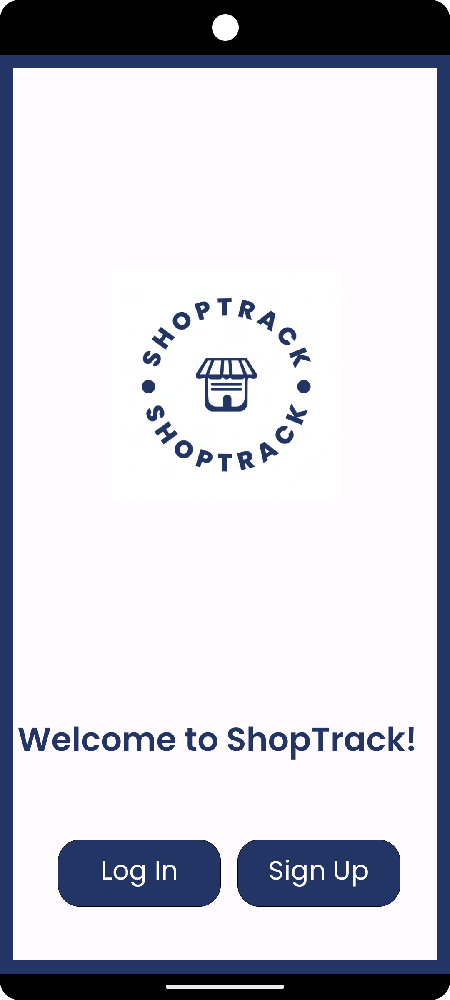
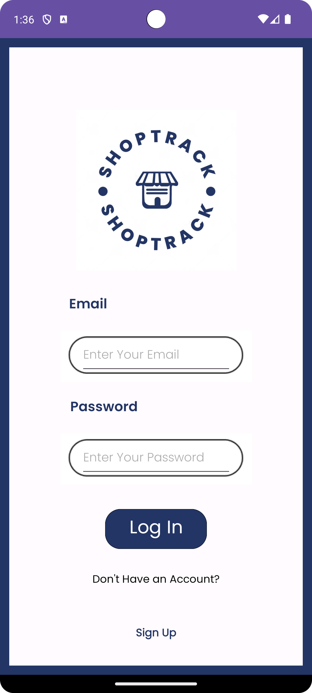
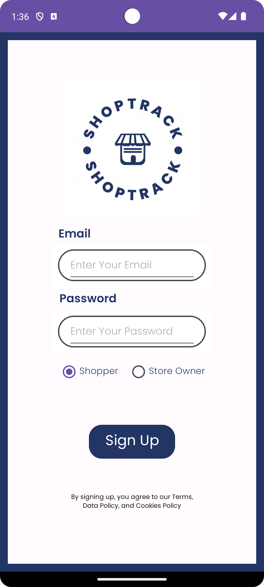
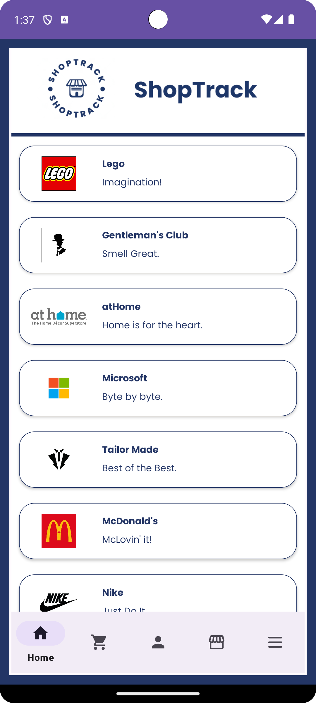
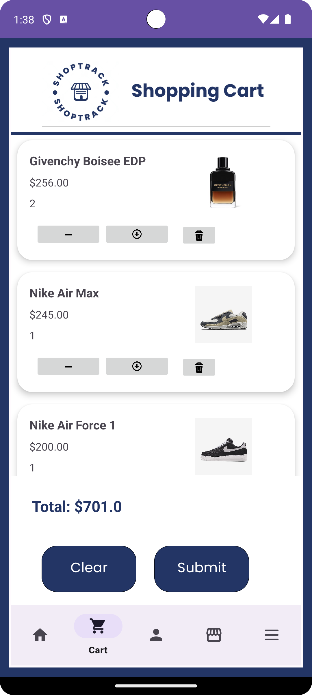
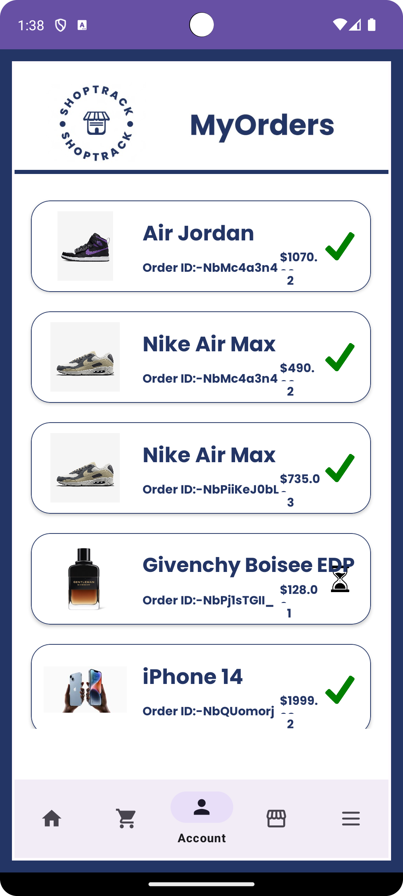
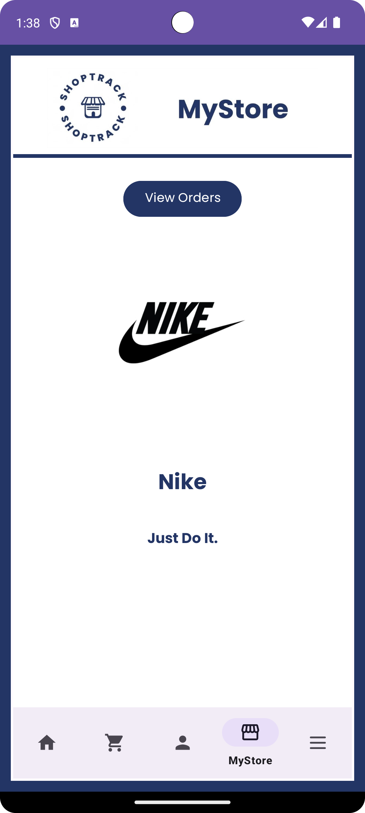
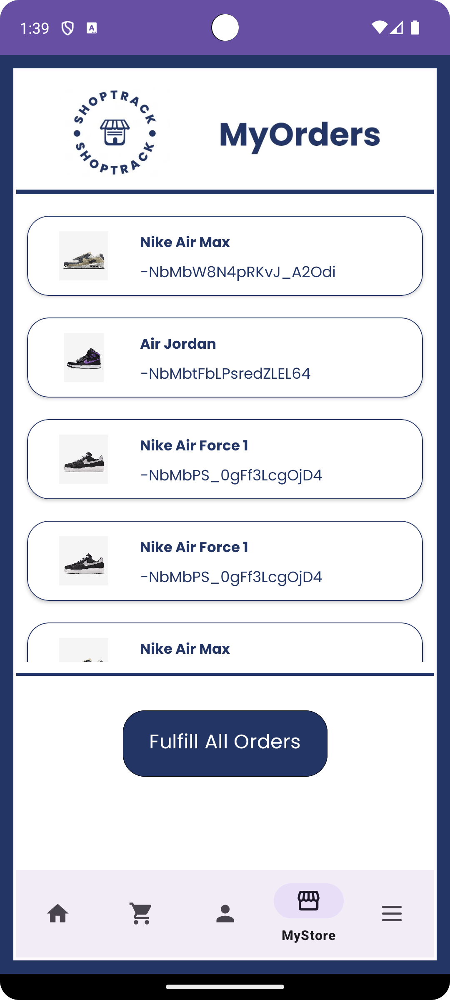
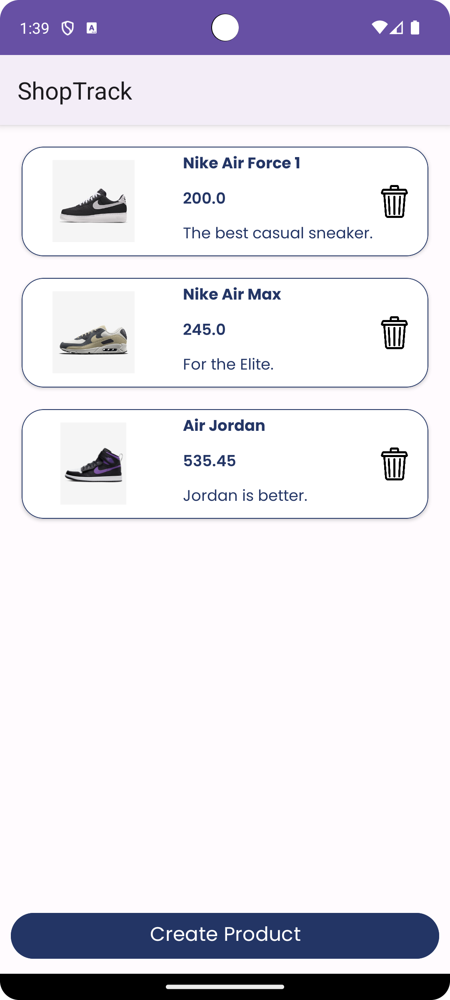

# ShopTrack

## Overview
ShopTrack is an Android native marketplace-inspired mobile app that allows users to purchase from one another, create stores, upload products, and track their orders. This app is a project for a Software Design course.

 

## Table of Contents
- [Functionality](#functionality)
- [Scrum](#srum)
- [Backend](#backend)
- [Design](#design)
- [Demo](#Demo)

 
 

## Functionality

- Download the ShopTrack app
- Users are asked to Login or Sign Up with their email and choose between being a vendor or seller
- Users are able to see previews of the stores and products available
- Create and/or delete products and stores if you are a store owner.

 

## Scrum
Scrum was employed as an effective project management framework for the development of ShopTrack, an Android-native marketplace-inspired mobile app. With a clear focus on enhancing user experience and functionality, the team utilized Scrum principles to prioritize and streamline the project's development process. Ten user stories, five representing the needs of customers and five addressing the requirements of store owners, served as the cornerstone of our development efforts.

 
These user stories were broken down into manageable tasks and organized into short, time-bound iterations known as sprints. Daily stand-up meetings facilitated open communication within the team, enabling us to promptly address any roadblocks or adjustments needed to meet our goals. 
 

The iterative nature of Scrum allowed for flexibility and adaptability, ensuring that the app's features and functionalities aligned with evolving user expectations. By incorporating Scrum, ShopTrack was not only delivered on time but also provided a dynamic and responsive platform for both customers and store owners to engage with the mobile marketplace seamlessly.
 

## Backend

Firebase served as the robust backbone of ShopTrack's backend infrastructure, effectively managing and storing crucial data for both customers and store owners. Leveraging Firebase Realtime Database, the app seamlessly stored and retrieved vital information, including vendor details, product listings, customer credentials, and order records. This real-time database offered the advantage of instant updates and synchronization, ensuring that all users had access to the most current data at all times. 
 

Firebase's authentication mechanisms bolstered the security of user credentials, safeguarding sensitive information. Furthermore, its scalability and reliability ensured that as ShopTrack grew, the backend infrastructure remained responsive and capable of handling increasing data loads. Firebase played an integral role in delivering a seamless and efficient experience for both customers and store owners, making ShopTrack a reliable and dynamic mobile marketplace platform.

## Design
Initially, Figma was used to design the UI of the app for the Login/SignUp, Home, Cart, Orders, Store, and Settings pages.

<h2>Welcome</h2>

 
 

<h2>Main Functionality Pages</h2>

 
 

<h2>Store Owner Pages</h2>

 
 

 

## Demo
Below is an example of creating a new store as a vendor, ordering from that store as a user and fulfilling the order from the vendor side. Users are able to order from multiple stores without placing order tracking functionality at risk.  
 

https://github.com/BrandanBurgess/ShopTrack/assets/133079825/f8ff9c95-fb6e-48d0-9ea7-4b6ee92138b1

 

<h1>Technologies Used</h1>

